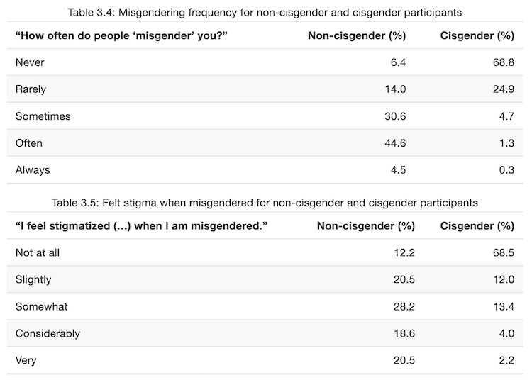
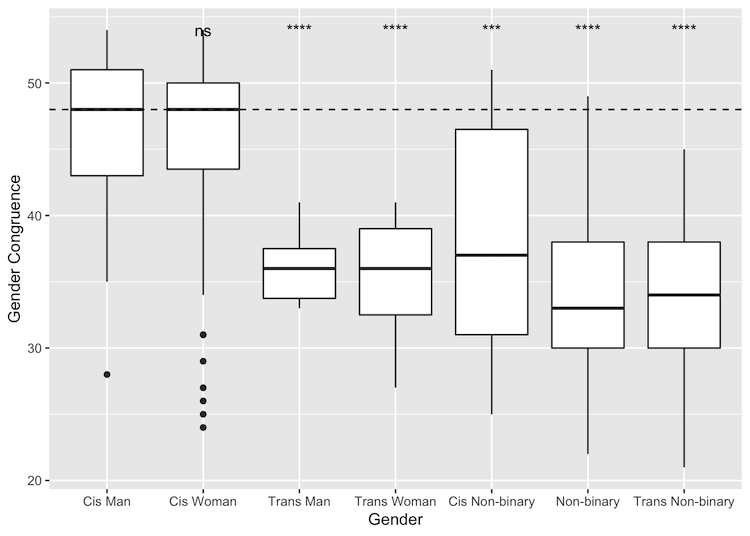
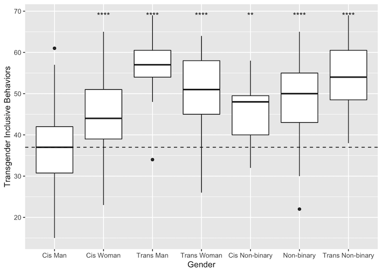
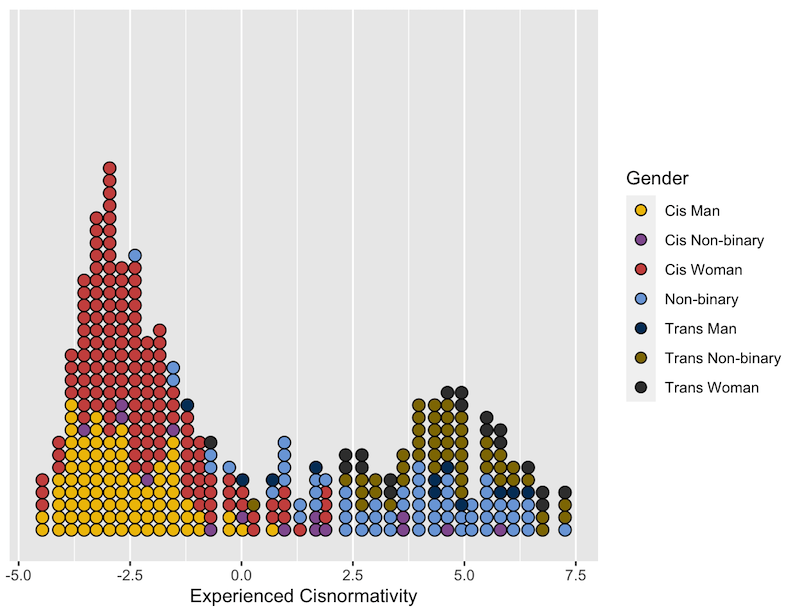
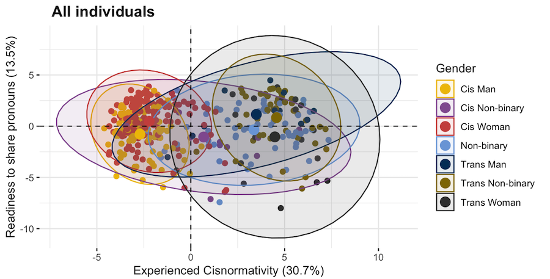
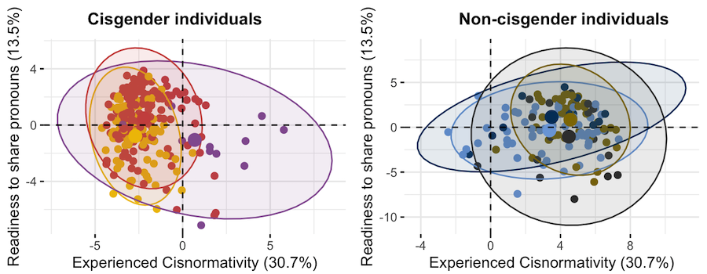
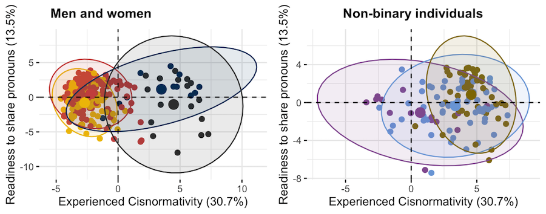
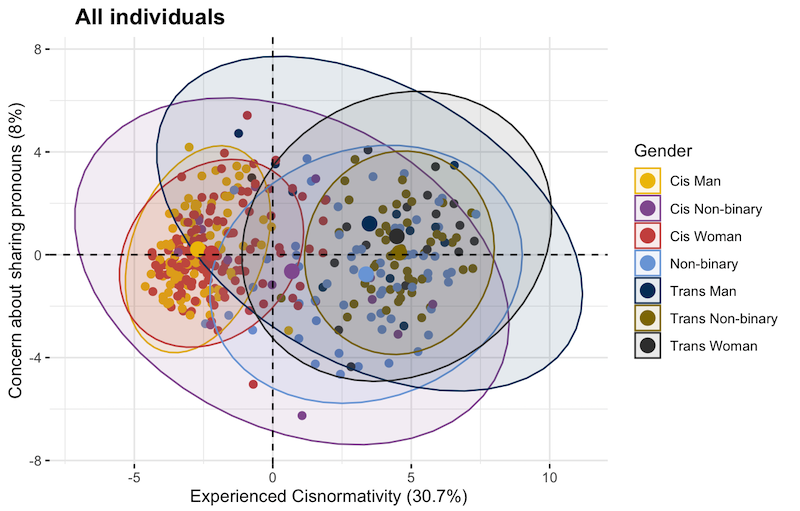

## Background & Definitions
- Pronoun: third-person gendered pronouns such as "she"
- Gender identity: one's internal sense of gender, relationship to many identities simaltaneously
- Cisgender: a descriptor for a gender identity that has a close relationship to one's gender assigned at birth
- Transgender: a descriptor for a gender identity that is different from one's gender assigned at birth
- Non-binary: a gender identity or relationship with gender that does not neatly fit into "man" or "woman"

## Objective
- Pronouns are very important to trans and non-binary people. However, they have not been examined in any detail. 
- Do cis and trans people have different relationships with pronouns?
- More broadly, do cis and trans people have different gendered experiences?

## Previously Validated Items
- Transgender Congruence Scale (TCS) [@kozeeMeasuringTransgenderIndividuals2012]
  - Measure of gender congruence
  - Designed for transgender people
  - Included as a comparison for novel items about pronoun congruence
- Trans-inclusive Behavior Scale (TIBS) [@kattariDevelopmentValidationTransgender2018]
  - Measure of how many trans-inclusive behavoirs one does
  - Designed for people of all genders
- Misgendering frequency [@mclemoreExperiencesMisgenderingIdentity2015]
  - Two items about how frequently one is misgendered and how stigmatized that makes one feel
  - Designed for transgender people
  
## Novel items
- Gender Pronoun Attitude Survey (GPAS)
  - Institution-specific questions about comfort sharing pronouns
  - Questions about congruence and relationships with pronouns
- Gender demographics
  - Are you cisgender?
  - Are you transgender?
  - Is your gender non-binary?

## Participants
- *N* = 477 undergrads, 33% of student body
- Not ethnically diverse, aproximately representative of Reed student body
- Median age was 20 (M = 20.14, SD = 1.32)
- 102 first years, 118 second years, 131 third years, and 120 fourth years
- 38 majors

## Analysis
- Seven artificial gender bins were created
- Cis man, cis woman, trans man, trans woman, cis non-binary, non-binary, and trans non-binary
- Created to balance need for speed of analysis with differences in gendered experiences

## Misgendering freq.

## TCS Scores

## TIBS Scores

## GPAS items
- Many significant gender effects
- Someone else sharing their pronouns makes other people significantly more comfortable sharing their own
- People frequently correctly assume cis people's pronouns, but not trans and non-binary people
- Trans and non-binary people feel like people understand them better when they share their pronouns

## Principal Component Analysis (PCA)
- We used PCA to reduce the GPAS and misgendering frequency items into 3 components 
- Eigenvalue of 3.07
- Accounted for 52.16% of the variance in the data

## Components
- Component 1: experienced cisnormativity (30.7% variance)
- Component 2: Readiness to share pronouns (13.5% variance)
- Component 3: Concern around sharing pronouns (8% variance)

## Component 1 by Gender

## Components 1 & 2 by Gender (All individuals)

## Components 1 & 2 by Gender (Cisgender & Non-cisgneder)

## Components 1 & 2 by Gender (Men and Women & Non-binary)

## Components 1 & 3 by Gender (All individuals)

## Conclusion
- Pronouns are not the same thing as gender
- Cis people have very different gendered experiences 
- Cis people should share their pronouns more
- Limitations/Future research
  - Analysis that integrates ethnicity, age, sexuality, major data
  - Department-specific analysis
  - PCA of all item responses

## References
